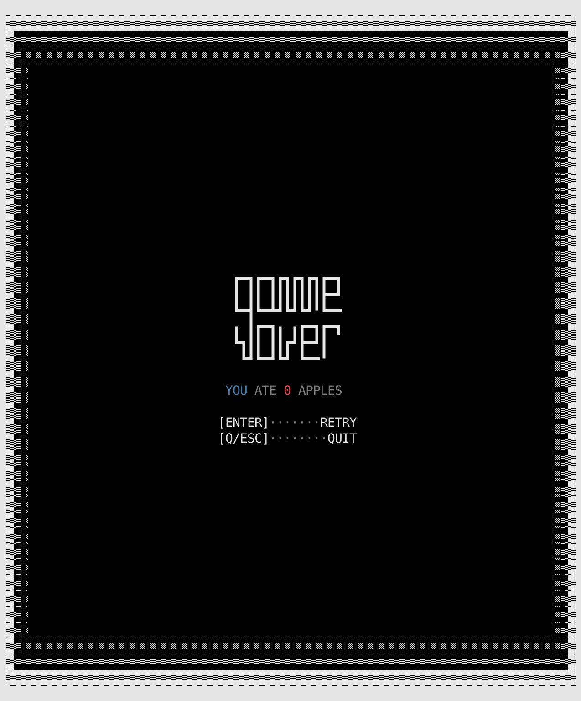
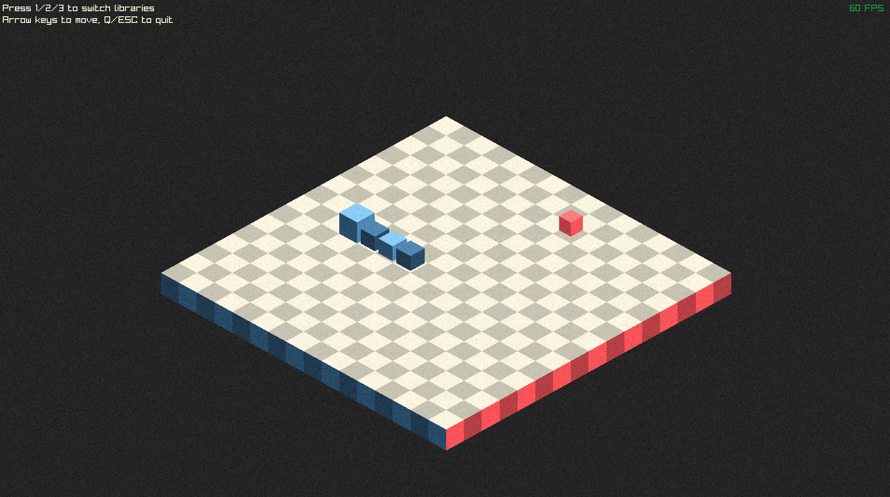
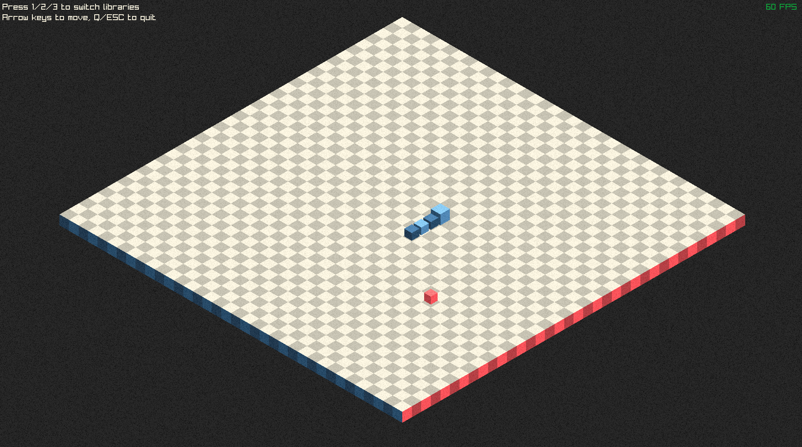
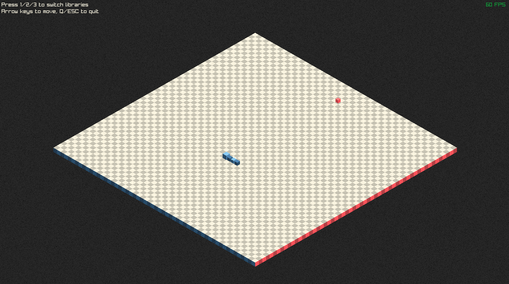
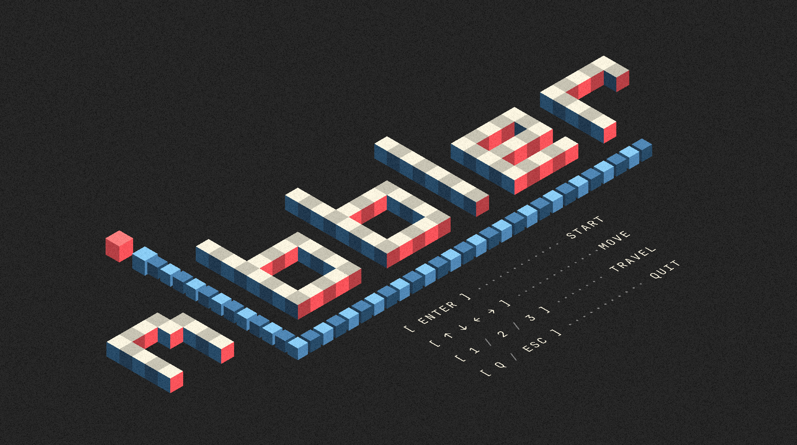

# Nibbler - Devlog - 11

## Table of Contents
1. [Day Eleven Plan](#111-day-eleven-plan)
2. [The Miracle of Standards](#112-the-miracle-of-standards)
3. [The Graphic Gardens of Eden](#112-the-graphic-gardens-of-eden)
4. [Encouraging, Which Is a Gerund](#114-encouraging-which-is-a-gerund)

<br>
<br>
<br>

## 11.1 Day Eleven Plan
A considerable chunk of today's working time has gone towards job applications, so I don't think there will be great advancements today. Still, there are a couple of hours left on the workclock, so let's put them to good use. Today's plan doesn't need a list, as it is quite straight forward: **working on the start and gameover screens** across platforms.

> *As I wrote this devlog, it seems that I fully adopted a snake + apple = garden of eden theme. By day 11, one must find ways to keep things joyful, right?*

> *This log ended up being about more than one day: from the 11th to the 15th work session. I don't want to change too much stuff here, so I'll just make the 12th devlog tart with *Day Sixteen Plans*.

> *I've rewritten the last comment 3 or 4 times at this point. Looks like I greatly misjudged how much time the reworking of the general menu aesthetics across libraries would take. Staying in character, I must say.*

<br>
<br>

## 11.2 The Miracle of Standards
When I first started this project I was fully focused on the implemententation of a general design, so I didn't pay much attention to the `C++` standarization. Because when I first learned this language I was bound to the `std98`, I still don't have completely automatized some of the tools provided by more recent standards, so now that we have a working build I think it is a good time to make a general assessment of the code and try to bring things as closer to de `std20` as I can.

In this regard, I'll start by making some crucial changes in `Main`:
1. Instead of having a plain old `const char *` array to store the `so` file paths, I'll move to a `constexpr std::array<std::string_view, 3>`
	- *This will reduce overhead because of the `constexpr` and will grant type safety, as `std::array` know its size at compile time*
	- *`std::string_view` will, on top of that, assure that there is no allocation, as this makes the whole data be comprised of just **a pointer + length (basically, same as `const char*`)***
	- *This also provides range-based iterator possibilities an bound checking, which I'm using right now but the future is impenetrable for the eyes of a mere mortal*

2. Instead of having a pointer based `GameState`, which I feel I went that way due to some `C`-like autopiloting inside my brain, I'll handle the contents of this struct via references. 
	- *This way there will not be null pointer concerns and ownership will be clearer (`Main` will own objects)*
```cpp
struct GameState {
    Snake& snake;
    Food&  food;
    // Removed unused foodChar field
    // ...
};
```
3. The array used for snake segments could use some `std::array` magic too, for the same reasons as point 1
4. Every `enum` I had would be better off being an `enum class`. For example, instead of having an `enum direction`, switching to an `enum class Direction`
	- *This needs some adaptations regarding the accessing of the enum itself, so that they go through *scoped names* (i.e., `Direction::UP`)*
	- *This provides tape safety, eludes namespace polluton and gives a layer of consistency with `GameStateType`, which was already an `enum class`
5. In the particle and background vectors in `SDL` could be enhanced by simply reserving the necessary memory for their containers. A `particles.reserve(maxDustDensity)` and a `borderLines.reserve(100)` in `init()` will suffice
	- *This is mainly to avoid reallocations when spawning, which greatly impacts performance (maybe not noticeably in the current build, but if the amount of spawning grows in the future, this will protect performance against said growth)*
6. In regards to performance, my random number generation was poopy. I did some research and noticed that I was repeating the creation of `std::random_device` and `std::mt19937` every time I generated a random int, so the logical thing to better this was to make every generation-dependent function go through a shared, well, generator.
	- Beyond what could be a massive performance improvent (again, if the game was bigger or after it grew, this could tank it), this also adds to the thread-safe initialization.
7. In `NCurses` menu handling (start and gameover screens), I was opening and reading the base files which contain the logo art every time I rendered them. This is a 101 case of *please, cache me, for the love of god*, so that's what I did.
	- *This needed the adition of a handful of new attributes inside the `NCursesGraphic` class, which are now feeded inside `init()`, as well as some rewriting of the draw functions to use the cached data instead of the base files*
	- *Again, we're in optimization mode, but this was particularly important because up until now every `NCurses` rendering call to menu related stuff was tied to a file I/O. For a lack of a better word, and risking myself into repetition: pooopy*
8. All colr declarations n `SDL2` where switched to `static constexpr` so that they are handled as **compile-time constants**, avoiding **runtime initialization**

And that's it for modernizations for now. I'll try to avoid the need to going back to this reviews from now on by switching my brain to `std20 = true`, but I'm only human, after all, I'm only human...

<br>
<br>

## 11.3 The Graphic Gardens of Eden
Snake, apple... Eden vibes, right? Whatever, there's design work to do...

First, let's try to finish the `NCurses` implementations by redesigning the gameover screens, both for small and large formats. I'll just reuse what I wrote for the start screen and use it to also draw the ending statuses. Here they are:

<p float="left">
  
  
</p>

Now, let's move on to the 2D realms of `SDL2`. This will first need a somewhat of homogenization (*however this cursed word is written*) pass, as I'd like for the main logic for the manus and middle screen to be the same across platforms. 

BEAKING NEWS! I've been working on the game's title/logo/whateveryouwantocallit. While drawing the `SDL`start screen, I started playing around with the idea of the `i` of `nibble` be the snake, blue body and red dot, and after a couple of iterations I arrived to a version that, at least for now, I like. I also implemented some particles as a trail for the snake, which are included in the title. So after doing this, I went back to `NCurses` to modify its logos to h o m o g e n i z e (*or however this cursed workd is written*) the a e s t h e t i c s. So here's the current state:

<p float="left">
  
  
</p>

<br>

Anyway, working in `SDL2` is been somewhat of a (small) challenge. I decided to draw by hand the logo, before moving into researching how to render text. I learned that a new sub-library needed to be handled, `SDL_ttf`, so I had to add the process of its fetching to `Makefile`. After that, the basic flow of text rendering was easy to get around (plenty of examples out there). I tackled this by writing an specific function dedicated to render text to serve as helper, but because things grew too much, I ended up dettaching the logic from `SDLGraphic` into it's own class (did the same for the particle System):

```cpp
#ifndef TEXTRENDERER_HPP
#define TEXTRENDERER_HPP

#include <SDL2/SDL.h>
#include <SDL_ttf.h>
#include <string>
#include <iostream>
#include "colors.h"

static constexpr SDL_Color customWhite{255, 248, 227, 255};  // Off-white
static constexpr SDL_Color customGray{136, 136, 136, 255};   // Gray

class TextRenderer {
private:
	SDL_Renderer* renderer;
	TTF_Font* mainFont;
	TTF_Font* smallFont;
	bool initialized;

public:
	TextRenderer(SDL_Renderer* renderer);
	~TextRenderer();

	bool init(int windowWidth);

	bool renderText(const std::string& text, int x, int y, int offset, 
	                TTF_Font* fontToUse, SDL_Color color, bool centered = false);

	void renderInstruction(int centerX, int centerY, int& offset,
	                       const std::string& labelText, const std::string& dotText,
	                       bool smallMode, TTF_Font* currentFont);

	void renderScore(int centerX, int centerY, int score, bool smallMode);
	void renderRetryPrompt(int centerX, int centerY, bool smallMode);

	TTF_Font* getMainFont() const { return mainFont; }
	TTF_Font* getSmallFont() const { return smallFont; }
	bool isInitialized() const { return initialized; }
};

#endif
```

The core of the text rendering pipeline is this function:
```cpp
bool TextRenderer::renderText(const std::string& text, int x, int y, int offset, 
								TTF_Font* fontToUse, SDL_Color color, bool centered) {
	if (!fontToUse || !initialized) return false;

	SDL_Surface* surface = TTF_RenderUTF8_Blended(fontToUse, text.c_str(), color);
	if (!surface) {
		std::cerr << "Text render error: " << TTF_GetError() << std::endl;
		return false;
	}

	SDL_Texture* texture = SDL_CreateTextureFromSurface(renderer, surface);
	if (!texture) {
		SDL_FreeSurface(surface);
		return false;
	}

	SDL_Rect destRect;
	if (centered) {
		destRect = {
			x - (surface->w / 2),
			y - (surface->h / 2) + offset,
			surface->w,
			surface->h
		};
	} else {
		destRect = { x, y + offset, surface->w, surface->h };
	}

	SDL_RenderCopy(renderer, texture, nullptr, &destRect);

	SDL_DestroyTexture(texture);
	SDL_FreeSurface(surface);

	return true;
}
```

Moving forward, I decided to draw both the title and the gameover of the SDL2 realm by hand, using geometry functions. Two reasons for this: 1) absolute control of the looks across game sizes and resolutions, 2) couldn't find a font that satisfied my needs, and making one by myself would take too much time. The general idea with the typography for these is to write words with snake-like squiggles, i.e., letters that could be written by moving the snake. I arrived at a point which is satisfactory enough, but might still evolve during development:

<p float="left">
  
  
</p>

There's no need to change typographies here because the words are, as I said, geometry based, so I can tweak the size of them by just changing the building block's size (`square` and `separator`). In `NCurses` I had to design two different ASCII based options because dynamically writting them char by char would literally end me. Aside from this, the title and gameover drawing functions in SDL were too big and, again, were cluttering my class code, so I made a secondary class `TitleHandler` to, you guessed it, handle the title renderings.

> I think I should/could make this helper classes be cross-plataform, i.e. work for every library, but I'll leave that for later. If I end up animating NCurses, the same goes for `ParticleSystem` (maybe even a future, upper-layered `AnimationSystem`, who's to say).

> I also made a slight tweak in the snake size handling. I had a hardcoded max size of 100 up until now, but that limit should be, at least for a basic `snake` recreation, equal to the game arena area - 2 area units. So I did that :D

At this point, I had to go back to `NCurses` to redesign the titles and logos there to look the same as the ones in `SDL` (saturday, 14:44, please, god, just smite me):

<p float="left">
  
  
</p>

<p float="left">
  
  
</p>

No, at least, lets rumble with `Raylib`. The first thing I want to do is enhancing the noise postprocessing pipeline, as it was quite shabby (i.e., *cutre*). I had a unique pattern slightly moving around the screen and I generally hated it, as what I wanted was something more akin to how a CRT/VHS noise would look like. In words, the noise would have to be completely changing patterns at each drawing frame, making it loook like *real* noise instead of some static overlay. This, on the other hand, came with possible dangers with the pattern management, because generating them at drawing time would be an anti-optimizing horrible decision. Instead of that, the patterns shoudl be generated at `init()`, and the drawing calls should pick between the set of generated patterns. Finding a sweet spot for their amount is kind of vibes based, but for now I went with 8, so that there's not too many byt there is enough to avoid visible repetition.

> I think that moving everything related to *things-that-are-animated* could be moved to a transversal `animationSystem` (one that would cover both `ParticleSystem` for `SDL2` and the necessary animated postprocessing additions in `Railib`, but I have to decide how joined and how separated things should be. What's clear is that once this visual revamping phase is done, I'll have to get into refactoring mode once again. That's (coding) life.)

Anyway, new attributes in `Raylib` to handle the new noise postprocessing, of which some initialization was added to the class constructor:
```cpp
// Postprocessing noise system
static const int							GRAIN_TEXTURE_COUNT = 8;
std::array<Texture2D, GRAIN_TEXTURE_COUNT>	grainTextures;
int											currentGrainFrame;
float										grainFrameTimer;
float										grainFrameInterval;
```

At `init()`, the pattern generation is done as seen below. The process is quite ordinary and is built around the tools given by the library: generate a grain image via `GenImageWhiteNoise()`, load it as texture using by calling `LoadTextureFromImage()` (destroying the generated image in the process, as after it's texturization is no longer needed, using `UnloadImage()`), and storing it in the managing array:
```cpp
// noise pattern generation
for (int i = 0; i < GRAIN_TEXTURE_COUNT; i++) {
	// Unique seeding for varaition
	Image grainImage = GenImageWhiteNoise(screenWidth, screenHeight, 0.75f);
	grainTextures[i] = LoadTextureFromImage(grainImage);
	UnloadImage(grainImage);
}
```

> As it is my memory-handling, God-given mission of avoiding any leaks, the `Raylib` linked graphics class' destructor unloads all generated textures, of course.

The pattern cycling, called from all rendering states (i.e., `menu`, `game`, `gameover`) is set up to be `50ms` (on deltaTime). Based on this interval, a randomly selected, pre-generated noise pattern is loaded. And thus we're noisy, as we should always be (conceptually, spiritually, politically speaking; please avoid being noisy around your peers (me) in your (my) working places).

```cpp
void RaylibGraphic::drawNoiseGrain() {
	DrawTextureEx(grainTextures[currentGrainFrame], (Vector2){ 0.0f, 0.0f }, 0.0f, 1.0f, (Color){ 255, 255, 255, 20 });
}
```

Next: The FOV (in my case, the isometric size) of the 3D camera was not being correctly calculated agains the game area size. This resulted in larger sizes being cropped, and small ones being rendered with too much offset and looking too tiny. I had to come up with a way of calculating the FOV value based on the sizes, but I didn't know exactly how to come up with a formula. I tested some size-FOV relations to get empirical data, getting this values:
```
Grid size 16 → FOV 40.0
Grid size 36 → FOV 67.5
Grid size 51 → FOV 100.0
```
There's a quadratic growth pattern here, which can be controlled with a coeficient extracted from this data. Basically, the quadratic formula `FOV = a*size² + b*size + c` needed specific `a`, `b`, and `c` fixed values, which can be extracted from solving a simple system of equations with the empiric data:
```
Point 1 (size=16, FOV=40):
a(16)² + b(16) + c = 40
256a + 16b + c = 40  ... equation (1)

Point 2 (size=36, FOV=67.5):
a(36)² + b(36) + c = 67.5
1296a + 36b + c = 67.5  ... equation (2)

Point 3 (size=51, FOV=100):
a(51)² + b(51) + c = 100
2601a + 51b + c = 100  ... equation (3)
```

Which resulted in the final calculation of the 3D camera's FOV, getting the visual results above it:
```
FOV = 0.022619*size² + 0.198810*size + 31.028571
```

<p float="left">
  
  
  
</p>

Moving on, drawing the nibbler logo/title with cubes was *kinda* easy, honestly quite similar as drawing it with squares in `SDL2`, but what for some god forsaken reason took me a lot of time was the centering of it all. In the end it was the silliest thing imaginable, but I had an exahusting fight to make the isometric, cube based `nibbler` logo be correctly positioned in my game world. Which is even worse if we take into consideration that the `Raylib` render is the one that that gives me more freedom when drawing the title, without any need of managing what happens if the size is this or that size, as everything is based on the game world size and the initialized values for `cubeSize` and `separator`. Anyway, it is done, and it looks like this:

<p float="left">
  
</p>

To achieve the isometric rendering of the instructions test I had to do some research. The research itself had a very easy first step, a google search of "Raylib draw text in 3D", which returned me this [link](https://www.raylib.com/examples/text/loader.html?name=text_3d_drawing). This is a community extension added to the base library (there are examples of `DrawText3D` in its documentation), which took me a while to process. Then I adapted an implementation of the pipeline in my `RaylibGraphic` class, like this:
```cpp
void RaylibGraphic::DrawText3D(Font font, const char *text, Vector3 position, float fontSize, float fontSpacing, float lineSpacing, bool backface, Color tint) {
    int length = TextLength(text);
    
    float textOffsetY = cubeSize * 7;
    float textOffsetX = -cubeSize * 7;
    
    float scale = fontSize / (float)font.baseSize;
    
    rlPushMatrix();
    rlTranslatef(position.x, position.y, position.z);
    rlRotatef(+90.0f, 0.0f, 1.0f, 0.0f);
    
    for (int i = 0; i < length;) {
        int codepointByteCount = 0;
        int codepoint = GetCodepoint(&text[i], &codepointByteCount);
        int index = GetGlyphIndex(font, codepoint);
        
        if (codepoint == 0x3f) codepointByteCount = 1;
        
        if (codepoint == '\n') {
            textOffsetY += fontSize + lineSpacing;
            textOffsetX = 0.0f;
        } else {
            if ((codepoint != ' ') && (codepoint != '\t')) {
                DrawTextCodepoint3D(font, codepoint, 
                    (Vector3){ textOffsetX, 0.0f, textOffsetY },
                    fontSize, backface, tint);
            }
            
            if (font.glyphs[index].advanceX == 0) {
                textOffsetX += (float)font.recs[index].width * scale + fontSpacing;
            } else {
                textOffsetX += (float)font.glyphs[index].advanceX * scale + fontSpacing;
            }
        }
        
        i += codepointByteCount;
    }
    
    rlPopMatrix();
}

void RaylibGraphic::DrawTextCodepoint3D(Font font, int codepoint, Vector3 position, float fontSize, bool backface, Color tint) {
	// Character index position in sprite font
	int index = GetGlyphIndex(font, codepoint);
	float scale = fontSize / (float)font.baseSize;
	
	// Character destination rectangle on screen
	position.x += (float)(font.glyphs[index].offsetX - font.glyphPadding) * scale;
	position.z += (float)(font.glyphs[index].offsetY - font.glyphPadding) * scale;
	
	// Character source rectangle from font texture atlas
	Rectangle srcRec = { 
		font.recs[index].x - (float)font.glyphPadding, 
		font.recs[index].y - (float)font.glyphPadding,
		font.recs[index].width + 2.0f * font.glyphPadding, 
		font.recs[index].height + 2.0f * font.glyphPadding 
	};
	
	float width = (float)(font.recs[index].width + 2.0f * font.glyphPadding) * scale;
	float height = (float)(font.recs[index].height + 2.0f * font.glyphPadding) * scale;
	
	if (font.texture.id > 0) {
		const float x = 0.0f;
		const float y = 0.0f;
		const float z = 0.0f;
		
		// Normalized texture coordinates of the glyph inside the font texture (0.0f -> 1.0f)
		const float tx = srcRec.x / font.texture.width;
		const float ty = srcRec.y / font.texture.height;
		const float tw = (srcRec.x + srcRec.width) / font.texture.width;
		const float th = (srcRec.y + srcRec.height) / font.texture.height;
		
		rlCheckRenderBatchLimit(4 + 4 * backface);
		rlSetTexture(font.texture.id);
		
		rlPushMatrix();
		rlTranslatef(position.x, position.y, position.z);
		
		rlBegin(RL_QUADS);
		rlColor4ub(tint.r, tint.g, tint.b, tint.a);
		
		// Front Face
		rlNormal3f(0.0f, 1.0f, 0.0f);
		rlTexCoord2f(tx, ty); rlVertex3f(x, y, z);
		rlTexCoord2f(tx, th); rlVertex3f(x, y, z + height);
		rlTexCoord2f(tw, th); rlVertex3f(x + width, y, z + height);
		rlTexCoord2f(tw, ty); rlVertex3f(x + width, y, z);
		
		if (backface) {
			// Back Face
			rlNormal3f(0.0f, -1.0f, 0.0f);
			rlTexCoord2f(tx, ty); rlVertex3f(x, y, z);
			rlTexCoord2f(tw, ty); rlVertex3f(x + width, y, z);
			rlTexCoord2f(tw, th); rlVertex3f(x + width, y, z + height);
			rlTexCoord2f(tx, th); rlVertex3f(x, y, z + height);
		}
		rlEnd();
		rlPopMatrix();
		
		rlSetTexture(0);
	}
}
```

This let's me do exactly what I wanted: write in axonometric view, chosing the perspective and direction. At this point, I'm happy with the start screen in `Raylib` version, so I'll move on to the gameover screen. But first, some refactoring is due again. I have to dettach the text and title rendering from the main `RaylibGraphic` class and take them to helper classes, the same way as I did for `SDL2`. This will also mean some renaming in the `SDL2` related helpers, as I didn't prefix them and their contents correctly (thanks, me from the past, for messing it up again). I'll refactor and come back with some gameover stuff...

<br>
<br>

## 11.4 Encouraging, Which Is a Gerund
This section's title is just another byproduct of me losing my mind. *"Animando, que es gerundio"*, blended through Google Translator just as a joke. Anyway, I'd like for my menu screens to be animated at some point (something e x t r e m e l y time dependent), but just in case I actually find the time to make it happen, some ideas:
- `NCurses`
	- Change the dithered parts of the big logo, randomizing them in the animation loop, making it look glitchy. (Why glitchy? I don't know, it might just be because it combines two important features: *cool* and *doable*)
	- Make the squiggles of the small logo slightly twitchy, growing and shrinking in the animation loop
- `SDL2`
	- Try to mimic the border animation in the letters (*this might break my spirit*)