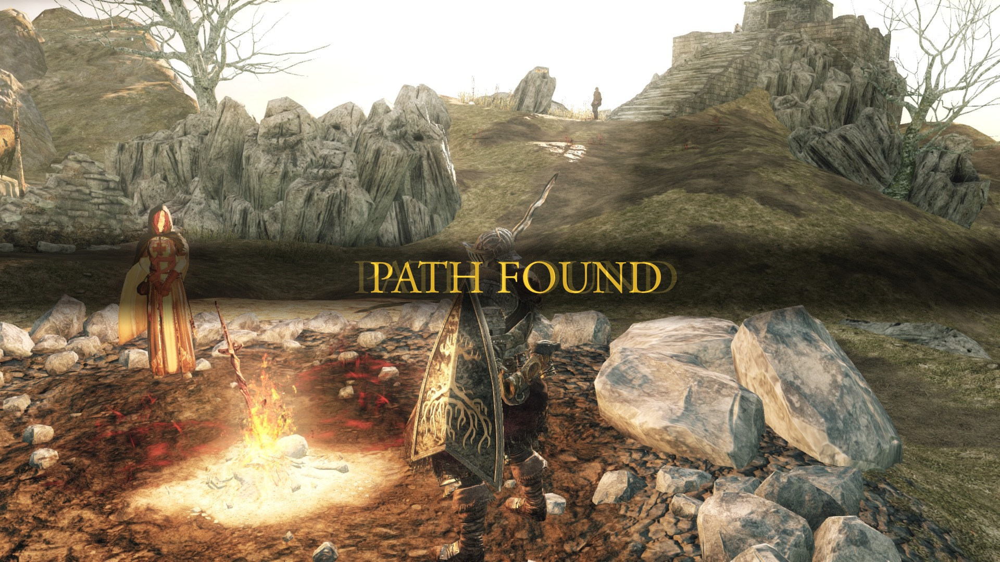

# Nibbler - Devlog - 15

## Table of Contents
1. [Day Twenty Plan](#151-day-twenty-plan)
2. [Not That Kind of AI!](#152-not-that-kind-of-ai)
3. [Too Many Whats in the Land of Hows](#153-too-many-whats-in-the-land-of-hows)
4. [The Closest Distance Between a Snake and an Apple](#154-the-closest-distance-between-a-snake-and-an-apple)
5. [Forewarned is Forearmed](#155-forewarned-is-forearmed)
6. [Deciding to LIVE (until DEATH is the only option)](#156-deciding-to-live-until-death-is-the-only-option)

<br>
<br>

## 15.1 Day Twenty Plan
Well, here we are. Twenty days, fifteen logs after the first steps into dynamic libraries, *nibbler* has to end. The task list for the day, though, is quite ambitious, so it is going to take every ounce of MIGHT and COURAGE to really make this the last development day on my side. (Technically, I'll have to wait for sounds on my partner side and surely spend one day integrating and testing the final build, and who knows how much time will the evaluation process chug, but that's beyond the scope of my very small, extremely average human powers). So, as I was saying, very ambitious, yet short to-do list for this twentieth battle agains the other side of this screen:
- Snake AI and `VsAI` mode enabling
- General check
- If time (haha), expand the test suite

It's already kinda late in the morning, so let's get going.

<br>
<br>

## 15.2 Not That Kind of AI!
In this day and age, which in 2026 is an expression that can only, if at all, cover a week's worth of time (who, among us, can predict the state of the world 7 days from today?), `AI` is a cursed word. With good reasons, specially when concepts like *generative* are attached to it, but luckily for us what we aim to build is a good old game AI that expands the multi-snake pattern into a `VsAI` game mode. To do so, and after some research, the bulk of the work is going to be placed on implementing well known algorithms, specifically a combination of `A*` and `Dijstra`, with some added switches and knobs to allow for difficulty settings and opponent configurations. Not the most difficult thing in the world, but something that I've not done too many times before, so it's going to be a battle. But this is where we are, *one battle after another**.

> *Interesting movie, recommended. I loved it at first, have had growing concerns over time. Better taken as a good, entertaining piece of art with some not-totally-focused will at political commentary.

<br>

### Eating Apple Is Important, But Not As Much As Not Dying
Implementing an algorithm that makes the AI snake chase apples would be quite easy. Doing so in a way that it also avoids it's own demise and feels different levels of smart is another can of worms. On top of this, once you start thinking about what a *smart* snake would entrail and the things that each of those details entrails, things start to get complicated. The best we can do before throwing ouselves into this battle for the computational ages is to lay out the needs and approachs for the AI implementation, from a conceptual level to boilerplate code translations that will then be developed. So let's break the shell with some key insights:
- **The real challenge** isn't eating, **is not dying with a belly full of apples** (after all, in the current, base design of *nibbler*, the dead player loses, no matter the distribution of apples. Being larger just gives you more ability to entrap the opponent).
- **Tail reachability is critical**, because that spot is always going to be a safe zone until the very end of the game (unlikely reached, a state of space fully covered by snake bodies, minus the 2-gap threadshold that signals the end of the game by exhaustion).
- **Difficulty will be a matter of parameter tunning**, not different and/or separate algos
- **Reacting to moving opponents** is what would give the *smart* finishing touch to the AI

Translating this into more fleshed out considerations, we can state the following:
1. **Space Management**
    - When grid gets crowded, the AI should **prefer moves that keep more open space aorund it**. Or at least this is how I play, but I'm no *snake* expert.
    - For territory control, my research tells me that `Voronoi` style **territory control** would enhance how the AI attempts to react to the opponent's presence in the game arena.
2. **Decision Priority** (matters mostly **when food path is unsafe**). In the mind of the AI snake:
    - Can I safely reach food? → Go for it!
    - If not, can I reach my tail? → Chase own tail, let's call it *survival mode*
    - Still a no? → Move towards the most open space zone
    - If at this point all we gather is a bag of Noes, just try to find the least bad movement, but this snake is cooked no matter what
3. **Opponent prediction**
    - For hard mode, predict the next 1 or 2 movements of the opponent. (I might need some black magic here)
    - If prediction succeeds, those targetted spots become D A N G E R  Z O N E S. Avoid!!
4. **Performance**
    - Even though the subject of matter (*snake*) and the controlled grid sizes allow for naive approaches without tanking implementation, refinement and optimization are paramount. The point here is to learn how to code good AI, not to simply insert an AI opponent in this basic snake game. (If that was the case, a manhattan magnitude, apple-obsessed snake would suffice, as I stated above)
    - Find the sweet spot for recalculation. Doing so at every tick might be possible in this game, but refer to previous point for further information.

And taking this into consideration, and as previously advanced, the route to AI excellence will be based on a combination of two algorthms, `A*` and `Dijkstra`. Why, you might ask, well I'm here to tell you. Both are, taken as a base approach, good for the task:
- `Dijkstra` is breadth-first with costs, which can be translated into human as "from my current position, flood the grid evenly until goal is reached", or in other words, it's a **flood-fill**. It is a good option when all moves cost the same (which right now is, I think, the case), distance maps are the objective and the subject grids are small, and has these basic properties:
    - Explores the space uniformly
    - Guarantees the shortest path
    - does *not* really know where the goal is (just finds it in real time)
- `A*` is kind of an enhancement over `Djikstra`, something along the lines of "do the same as Dijkstra but prioritize nodes closer to the goal". I.E, a refinement. It weights costs and makes decisions based on an heuristic, which in an ortogonally moving snake is usually the `Manhattan distance` (|x1 - x2| + |y1 - y2|). It's much faster, more goal oriented and relatively optmal if the heuristic is admissible, and is based on these building blocks:
    - **`g(n)`** = cost so far
    - **`h(n)`** = heuristic (estimated distance to goal)
    - **`f(n) = g(n) + h(n)`**

So, combinig both algos, we can get an approach that can be summed up as **"`A*` for intent, `Dijkstra` like flood-fill for safety**. With even *more other* words, this combination will make the snake **find the food, the simulate moving towards it, then check if tail is still rechable after the hipothetical chomp**. Alongisde, difficulty levels can be, at least ideally, design this way:
- EASY
    - greedy movement (APPLE > ALL)
    - short A* search depth
    - long-term trapping ignored
    - delayed reactions
- MEDIUM
    - full A* to food
    - basic collision avoidance
    - no tail-reachability check
- HARD
    - A* to food
    - safety simulation (path finded check)
    - tail reachability via flood fill
    - avoid risky enclosures by prioritizing open spaces
    - reactive to opponent (dynamic obstacle, prediction in the mix)
Easier written than coded, even more if we want to constrain the amount of variables and knobs, which shouldn't expand beyond:
- N ticks between recomputations
- A* node expansions cap
- Radom move chance (a cheap, artificial addition to dampen the snake's intelligece, but could add the finishing touches for a more *naturalistic* game feel)

<br>

## 15.3 Too Many Whats in the Land of Hows
Enough about words, let's lay out some code plans. A new `AI/` subdirectory will be added to `srcs/`, with a handful of, as per my predictions, needed new classes and data related stuff:
- Pathfinder → `A*` implementation
- Floodfill → `Djikstra` implementation (role of safety checker)
- SnakeAI → Main AI class, the decision maker if you will
- AIConfig → Settings (mainly for difficulty, decoupled from main game's settings because there will not always be an AI opponent)

Also, to prepare the testing grounds some already existing stuff will need to be changed/expanded, like the addition of an extra mode to `GameMode`, with the corresponding initialization and update steps in `GameManager`. All together, in code (and subject to possible future changes):
```cpp
enum class GameMode {
	SINGLE,
	MULTI,
	AI
};
```
```cpp
class PathFinder {
public:
	struct Node {
		Vec2 pos;
		int gCost;                              // Distance from start
		int hCost;                              // Heuristic to goal
		int fCost() { return gCost + hCost; }
		Node* parent;
	};
	
	std::vector<Vec2> findPath(
		const GameState& state,
		Vec2 start,
		Vec2 goal,
		int maxDepth = 200                      // Difficulty tuning
	);
	
private:
	int manhattanDistance(Vec2 a, Vec2 b);
	bool isReachable(const GameState& state, Vec2 pos);
};
```
```cpp
class FloodFill {
public:
	// count reachable empty cells from start
	int countReachable(
		const GameState& state,
		Vec2 start,
		const std::vector<Vec2>& ignorePositions = {}       // mostly for the tail right now
	);
	
	bool canReachTail(
		const GameState& state,
		const Snake& aiSnake,
		const std::vector<Vec2>& proposedPath
	);
	
private:
	std::vector<std::vector<bool>> visited;
	void floodFillRecursive(const GameState& state, Vec2 pos);
};
```
```cpp
class SnakeAI {
public:
	SnakeAI(AIConfig config);
	
	Input decideNextMove(const GameState& state);
	
	private:
		AIConfig config;
		PathFinder pathFinder;
		FloodFill floodFill;
		
		// decision modes
		Input goToFood(const GameState& state);
		Input survivalMode(const GameState& state);
		Input maximizeSpace(const GameState& state);
		
		// safety checks
		bool isSafeMove(const GameState& state, Vec2 nextPos);
		int evaluateMoveSpace(const GameState& state, Vec2 nextPos);
};
```
```cpp
struct AIConfig {
	// this is were difficulty settings are, well, set
	enum Difficulty { EASY, MEDIUM, HARD };
	
	Difficulty level;
	
	// Timing
	int thinkDelay;			// Ticks between decisions (0 = every tick)
	
	// Pathfinding
	int maxSearchDepth;		// Node expansion limit
	bool useSafetyCheck;	// Tail reachability
	bool predictOpponent;	// Consider opponent movement
	
	// Behavior
	float randomMoveChance;	// 0.0 - 1.0 (for easy mode)
	float aggressiveness;	// 0.0 = cautious, 1.0 = greedy
	
	static AIConfig easy();
	static AIConfig medium();
	static AIConfig hard();
};
```

Now, I'll go and make the necessary changes in the current build to be able to start implementing/testing the AI. Be right back...

... And everything is ready to start developing the AI (SDL's menu now has the `VsAI` option available, and the GameManager is set up to ask the AI for moves and buffer them as inputs).

<br>

## 15.4 The Closest Distance Between a Snake and an Apple
Let's face our first great foe, the **pathfinding**. Its key functions are going to be:
```cpp
std::vector<Vec2> PathFinder::findPath(Vec2 start, Vec2 goal, const GameState& state);
int manhattanDistance(Vec2 a, Vec2 b);
bool isWalkable(Vec2 pos, const GameState& state);
```
Writing an `A*` algorithm is basically like exploring a maze with priority queue. The **most promising path** must always be checked first:
- Check paths that look closer to the goal first
- Track distance traveled to prevent infinite loops

The implementation itself is sustained by coding the ability to:
- Calculate the manhattan distance between nodes (abs difference between x and y sum path)
- Check if a node is walkable (not ocuppied, in bounds, not a wall, ...)
- Get every neighbour of a node for iteration (up, down, left, right)
- Reconstruct a path from a list of checked and confirmed path-forming nodes
- A main pathfinding loop, based on a couple of data containers (and one that cleans up after itself!):
```cpp
std::multiset<Node*, CompareNode> openList;
std::vector<std::vector<bool>> visited(state.width, 
											std::vector<bool>(state.height, false));
std::vector<Node*> allNodes; //needed for clenaup
```

> Using `multiset` for the `openList` because it:
> - Automatically sorts by f-cost (lowest first)
> - Allows duplicate f-costs (multiple paths with same cost)
> - Dulicates are accepted for simplicity (the `visited` array prevents infinite loops)

So, the core of the PathFinding looks like this:
```cpp
std::vector<Vec2> PathFinder::findPath(const GameState &state, Vec2 start, Vec2 goal, int maxDepth) {
	std::multiset<Node*, CompareNode> openList;
	std::vector<std::vector<bool>> visited(state.width, 
											std::vector<bool>(state.height, false));
	std::vector<Node*> allNodes; //needed for clenaup

	Node *startNode = new Node {
		start,
		0,
		manhattanDistance(start, goal),
		nullptr
	};

	openList.insert(startNode);
	allNodes.push_back(startNode);
	int nodesExplored = 0;

	while (!openList.empty() && nodesExplored < maxDepth) {
		nodesExplored++;

		Node *current = *openList.begin();
		openList.erase(openList.begin()); // take the begin node because CompareNode sorts ascending, i.e. the one with lowest f-cost

		if (current->pos.x == goal.x && current->pos.y == goal.y) {
			// found the food
			std::vector<Vec2> path = reconstructPath(current);

			cleanAllNodes(allNodes);

			return path;
		}

		visited[current->pos.x][current->pos.y] = true;

		std::vector<Vec2> neighbors = getNeighbors(current->pos);

		for (Vec2 neighborPos : neighbors) {
			// skip non walkable and visited positions
			if (!isWalkable(state, neighborPos)) continue;
			if (visited[neighborPos.x][neighborPos.y]) continue;

			int tentativeGCost = current->gCost + 1; // minimum cost would be one step
			int hCost = manhattanDistance(neighborPos, goal);

			Node * neighborNode = new Node {
				neighborPos,
				tentativeGCost,
				hCost,
				current		//parent is current node
			};

			openList.insert(neighborNode);
			allNodes.push_back(neighborNode);
		}
	}

	cleanAllNodes(allNodes);

	return {};
}
```

1. Sets up the necessary data structures and a counter for explored nodes (the latter for difficulty options)
2. Creates a base, starting node and inserts it in the `openList` (the loop is based around it's contents)
3. Builds a loop, with dependency on the `openList` (not empty) and the amount of explored nodes (maxDepth, set up in the difficulty presets, marks the end of a search (its breadth, basically))
4. The loop iself:
    1. **Picks** the first node from `openList` (remember, already sorted)
    2. **Checks** if it's the goal position and if so, reconstruct the path
    3. **If not goal**, mark spot as visited, get its neighbors and insert them into `openList`
    4. **Repeats** until goal is reached or game space is exhausted (or maxDepth is reached)

The reconstruction process of the path is fairly simple:
```cpp
std::vector<Vec2> PathFinder::reconstructPath(Node *goalNode) {
	std::vector<Vec2> path;
	Node *current = goalNode;

	// main idea -> follow parent nodes backwards
	while (current != nullptr && current->parent != nullptr) {
		path.push_back(current->pos);
		current = current->parent;
	}

	std::reverse(path.begin(), path.end());

	return path; // starting position is not included because the snake is there
}
```

Each `Node` stores a pointer to its `parent` (the node it came from). This creates a **linked list 
from goal back to start**. The reconstruction process:
1. Starts at the goal node
2. Follows `parent` pointers backwards
3. Collects positions into a vector
4. Reverses the vector to get **start → goal** order
5. Excludes the starting position (the snake is already there)

The result: a vector of positions representing the optimal path! (Or alternatively: P A T H  F O U N D*)

> *imagine this as a you died *dark souls* screen, why not, it's free.

> you know what, I'm going to do it:



<br>
<br>

## 15.5 Forewarned is Forearmed
I did a quick check for the equivalent to the spanish expression *hombre precavido vale por dos* and apparently this is the one. Unimportant. Let's now focus in the **flood fill** based safety checker, which has the following key functions:
```cpp
int FloodFill::countReachable(Vec2 start, const GameState& state);
bool FloodFill::canReachTail(const std::vector<Vec2>& path, const GameState& state);
```

The FloodFill serves as **safety net**, i.e. it prevents the AI from trapping itself. I've written my ass off today, so I'll try to be brief (spoiler: I failed), and, honestly, the logic behind pathfinding and floodfilling, in the scope of this project's implementations, is quite similar. (Also, this part is quite simpler):

#### **`countReachable()` - BFS-based space counter:**

This is, at its core, a breadth-first search that answers the question: *"How many cells can I reach from here?"* (not counting the one I'm going to end up in after losing my mind over this project) 

**Algorithm breakdown:**
1. Start from a position and flood outward
2. Mark each visited cell to avoid counting twice
3. For each cell, check all 4 neighbors (up, down, left, right)
4. If a neighbor is walkable (not snake, not wall) → add to queue
5. Keep going until queue is empty
6. Return total count

The implementation uses a `std::queue` for BFS traversal and a 2D `visited` array to track explored cells. FIFO, simplicity, etc and whatever.

> **Key feature:** The `ignorePositions` parameter gives the ability to treat certain snake segments as empty space, which is *critical* for the tail reachability check.

#### **`canReachTail()` - The survival checker:**

This is where things get interesting (right?). The function simulates: *"If I eat the food, will I trap myself?"*

**The logic:**
1. Get the new head position (end of path to food)
2. Identify current tail position
3. Count reachable cells from new head, **treating current tail as empty** (it will move away after the snake moves)
4. Compare reachable space vs snake's new length (current + 1 for growth)
5. Return `true` if `reachable >= snake.length + 1`, `false` otherwise

> The tail is ignored because after the snake moves and eats, the tail position becomes empty space. We need to account for this *future state*, not the current one. This forward-thinking is what makes the AI S M A R T  A S  H E L L.


#### **GridHelper - DRY principle in action**

Because `FloodFill` and `PathFinder` needed shared functions (`isWalkable`, `getNeighbors`, `manhattanDistance`), I resolved to giving them a shared base class. `GridHelper` now holds these common utilities, and both AI components inherit from it.

> for further specific code implementations, go to the source files!! I'm TIRED!!!

<br>
<br>

## 15.6 Deciding to LIVE (until DEATH is the only option)

With Pathfinder and FloodFill in place, it's time for the brain of the operation: **SnakeAI**. This is where all the pieces come together into a decision-making engine that, hopefully, won't immediately run into a wall and die (oh, the dream).

The AI brain operates on a **3-tier decision hierarchy**, cascading from aggressive to defensive strategies:

### **Tier 1: go to food**

```cpp
Input SnakeAI::goToFood(const GameState& state) {
    if (!state.snake_B) return Input::None;
    
    Vec2 head = state.snake_B->getSegments()[0];
    Vec2 foodPos = state.food.getPosition();
    
    // find food path
    std::vector<Vec2> path = pathFinder.findPath(state, head, foodPos, config.maxSearchDepth);
    
    if (!path.empty()) {
        // tail reachable check (HARD MODE ONLY)
        if (config.useSafetyCheck) {
            if (!floodFill.canReachTail(state, *state.snake_B, path)) {
                // if the path is unsafe, go into survival mode
                return survivalMode(state);
            }
        }

        return positionToInput(head, path[0]);
    }
    
    // no food path triggers survival mode too
    return survivalMode(state);
}
```

The AI asks: **"Can I safely eat this food?"**
- Uses A* to find optimal path to food
- **Hard mode:** Validates safety with FloodFill (`canReachTail`)
- **Easy/Medium:** Y O L O, just go for it
- If path is unsafe or doesn't exist → turn into survival (quite frankly, I'm starting to feel that this AI is extremely relatable)

Depending on difficulty:
- **EASY**: Short search depth (50 nodes), no safety → rushes food, easier to trap itself
- **MEDIUM**: Better search (100 nodes), no safety → smarter but still risky
- **HARD**: Full search (200 nodes), safety validation → only takes safe apples

### **Tier 2: S U R V I V E**

```cpp
Input SnakeAI::survivalMode(const GameState& state) {
    if (!state.snake_B) return Input::None;
    
    Vec2 head = state.snake_B->getSegments()[0];
    const Vec2* segments = state.snake_B->getSegments();
    int length = state.snake_B->getLength();
    Vec2 tail = segments[length - 1];
    
    // try to reach tail because it's always moving, i.e. it is always a safe spot
    std::vector<Vec2> pathToTail = pathFinder.findPath(state, head, tail, config.maxSearchDepth);
    
    if (!pathToTail.empty()) {
        return positionToInput(head, pathToTail[0]);
    }
    
    // If tail is not reachable, just go towards open space
    return maximizeSpace(state);
}
```

The AI asks: **"Can I reach my tail?"**
- The tail is *always moving*, making it a perpetually safe target
- Chasing it creates a circular pattern (looks weird, but going against this would we weird, no?)
- Keeps the snake alive when food is too risky
- If even tail is unreachable → go into space maximization

### **Tier 3: not wanting to die**

```cpp
Input SnakeAI::maximizeSpace(const GameState& state) {
    if (!state.snake_B) return Input::None;
    
    Vec2 head = state.snake_B->getSegments()[0];
    
    // pick the direction (among the 4 available) with most open space
    int bestSpace = -1;
    Input bestMove = Input::None;
    
    Input directions[] = {Input::Up_B, Input::Down_B, Input::Left_B, Input::Right_B};
    
    for (Input dir : directions) {
        Vec2 nextPos = getNextPosition(head, dir);
        
        // Check move safety
        if (isSafeMove(state, nextPos)) {
            // If it is safe, count the reachable spots
            int space = floodFill.countReachable(state, nextPos, {});
            
            if (space > bestSpace) {
                bestSpace = space;
                bestMove = dir;
            }
        }
    }
    
    return bestMove;
}
```

The AI asks: **"Which direction gives me the most room to breathe?"**
- Tests all 4 directions
- Uses FloodFill to count reachable cells for each
- Picks the direction with maximum open space
- Last ditch effort before inevitable doom

This is the "I'm trapped but at least I'll die in the biggest room" strategy. And in the process, I might even survive. Good for you, little snake.

#### **Movement Decision**

```cpp
Input SnakeAI::decideNextMove(const GameState& state) {
    if (!state.snake_B) return Input::None;
    
    // EASY MODE → Random moves sometimes
    if (config.level == AIConfig::EASY && config.randomMoveChance > 0.0f) {
        float roll = static_cast<float>(std::rand()) / static_cast<float>(RAND_MAX);
        if (roll < config.randomMoveChance) {
            // random move must still be valid, unless we want artificial AI deaths (WE DONT)
            return maximizeSpace(state);
        }
    }
    
    // decision hierarchy:
    // 1 - Try to go to food
    Input foodMove = goToFood(state);
    if (foodMove != Input::None) {
        return foodMove;
    }
    
    // 2 - If can't get food safely, go into survival mode
    Input survivalMove = this->survivalMode(state);
    if (survivalMove != Input::None) {
        return survivalMove;
    }
    
    // 3 - just D O N T   D I E
    Input spaceMove = maximizeSpace(state);
    if (spaceMove != Input::None) {
        return spaceMove;
    }
    
    // 4 - AI is turbo cooked, but something needs to be returned
    return Input::Left_B;
}
```

This is called every frame by `GameManager`. It:
1. Checks for Easy mode randomness (15% dumb snake)
2. Tries food → survival → space in order
3. Returns first valid move
4. Has a fallback (Left) to prevent crashes

#### **Integration with GameManager**

```cpp
void GameManager::update() {
    // If AI mode → generate AI decision each frame
    if (_state->config.mode == GameMode::AI && aiController && _state->snake_B) {
        Input aiMove = aiController->decideNextMove(*_state);
        if (aiMove != Input::None) {
            bufferInput(aiMove);
        }
    }
    
    processNextInput();
    // ... rest of game logic
}
```

Every frame, if we're in AI mode:
1. AI decides next move
2. Move gets buffered (same as player input)
3. Input processing applies move to snake_B
4. Snake moves, collision detection runs, repeat

> The AI is treated just like a player with really fast reflexes. I feel that I'm in the same spot as when I wrote the AI for my [Pong Engine](https://github.com/hugomgris/pong), in the sense that writing an AI for these type of games is tricky if you want to make it 1) work fine and 2) be beatable. Either there is a stronger, more present error prone pipeline in the decison making, or the AI reigns. If someone has any advice in this line, write me!!

---

And that's that. AI is implemented. I *just* need to handle some rendering stuff, like the color of the AI snake across libraries and some tweaks in the results/gameover screens, and my *nibbler* journey will be done*.

>*pending sounds (partner!) and review process.
